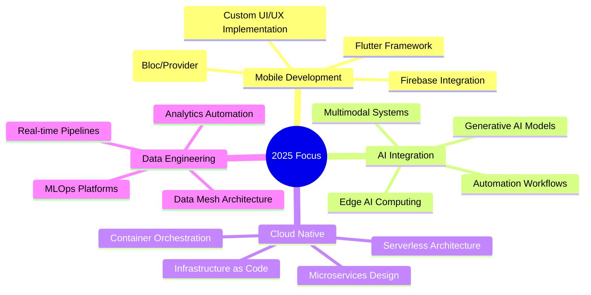

  

<!-- SOCIAL LINKS -->

  
  
  
  

---

## About Me

  

Software Engineer from **Chittagong, Bangladesh**, currently working at **PEN Global** and a graduate of **CUET**. Passionate about building scalable applications, seamless mobile experiences, and turning complex problems into elegant digital solutions.

**Current Focus:** Mastering Flutter, exploring AI-driven automation, and building cloud-native architectures.

---

## Technical Toolkit

### Core Specializations

### Technology Stack

---

## Domain Expertise

### Data Engineering: ETL Pipelines • Data Analytics • ML Operations

### DevOps & Cloud: Infrastructure as Code • CI/CD • Orchestration

### Mobile App Development: Flutter • Dart • Firebase • State Management

### Software Development: Full-Stack Development • Web APIs • UI/UX Design

## Professional Certifications

### Certification Portfolio

### AWS & Google Cloud

**Cloud Practitioner** • **Generative AI** • **ML Foundations** • **Serverless Computing** • **LLM Introduction** • **Responsible AI**

### Data Science & Security

**OpenAI API Systems** • **Time Series ML** • **TensorFlow/OpenCV** • **Cisco Cybersecurity** • **Linux Essentials** • **Python PCEP** • **IBM Deep Learning** • **Containers/Kubernetes** • **COBOL Programming**

  
<i>A comprehensive collection of professional certifications validating expertise across cloud platforms, DevOps practices, AI, data science, and security domains.</i>

---

## GitHub Analytics

  

<table>
<tr>
<td align="center">
  
</td>
<td align="center">
  
</td>
<td align="center">
  
</td>
</tr>
</table>

---

### Strategic Development Areas

